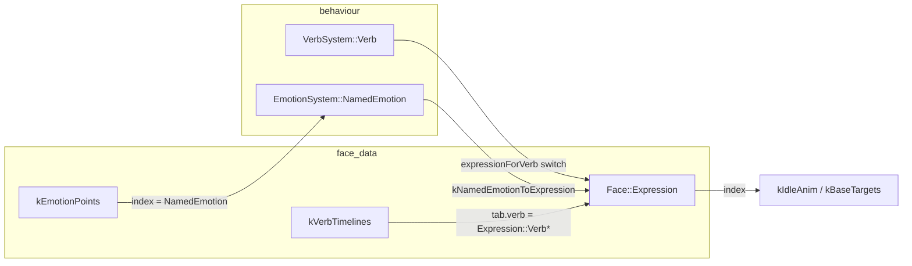

# Dynamic emotion and verb arrays

Design notes for making **named emotions** and **verb timelines** fully
add/remove/rename-able in the face editor, with generated `FACE_CONFIG_DATA`
(`.ts` / `.h`) and firmware that stay in sync after save + reflash.

**Status:** planning — no implementation yet.

---

## 1. Goal

Today the editor can mutate **values** inside fixed schemas (V/A positions,
`kBaseTargets` rows, verb keyframes) but not **membership**:

| Capability | Today | Target |
| ---------- | ----- | ------ |
| Add/remove/rename emotion anchor | No (14 fixed slugs) | Yes |
| Add/remove/rename verb timeline | No (8 fixed `Verb*` expressions) | Yes |
| Edit keyframes / geometry / motion rows | Yes | Yes |
| Save → firmware compiles and runs | Yes (same enum set) | Yes (regenerated enums) |
| Duplicate emotion/verb names | N/A | Rejected at save + in UI |

Success looks like: create `"curious"` emotion on the blend map, tune geometry,
save, flash — robot snaps/blends correctly. Create `"debugging"` verb timeline,
add keyframes, map `activity.started` → `"debugging"` in behaviour config (or
reserved mapping table), save, flash — face plays the new timeline.

---

## 2. Current architecture (why it’s stuck)

Three parallel taxonomies are **compile-time enums** wired together by convention
and large `switch` statements:



### 2.1 `EmotionSystem::NamedEmotion` (14 values)

- Anchors: `kEmotionPoints[]`, `kEmotionNames[]`, `kPickOrder[]`.
- Triangulation: `EmotionTriangulation.h` (generated; anchors carry
  `NamedEmotion` enum literals).
- Runtime: `EmotionSystem` stores `NamedEmotion snappedCurrent` and uses enum
  indices everywhere.

**Editor:** `emotionNames[]` + `emotionPoints[]` exist in `FaceConfigState` but
codegen still emits a **hardcoded** `NamedEmotion` enum preamble in
`emitFaceConfigH.ts` (`FACE_ENUM_PREAMBLE`). Validation does not allow length ≠ 14.

### 2.2 `Face::Expression` (22 values)

Union of:

- **Emotion expressions** (14) — real `kBaseTargets` geometry.
- **Verb expressions** (9) — `FACE_ROW_EMPTY`; face comes from `kVerbTimelines`.
- **Neutral** sits in both roles.

Many tables are `[Expression::Count]`:

- `kBaseTargets` (28 fields incl. arm), `kIdleAnim`
- `kExpressionNames`, `kExpressionIsEmotion`

**Editor:** `expressions[]` is fixed to `EXPRESSIONS` in `faceConfigTypes.ts`;
`validate.ts` rejects any other length.

### 2.3 `VerbSystem::Verb` (10 behavioural values)

Behaviour state machine (`EventRouter`, bridge commands). **Not** the same type
as timeline rows, but 1:1 mapped in `SceneContextFill::expressionForVerb()`.

Hardcoded in:

- `VerbSystem.cpp` (`parseVerb`, `verbName`, auto-decay rules)
- `EventRouter.cpp` (session/activity → `Verb::Reading` etc.)
- `expressionUsesVerbTimeline()` (which `Expression` values get timelines)

### 2.4 Other fixed consumers

| Area | Fixed assumption |
| ---- | ---------------- |
| `Settings::NamedColor` | One NVS palette slot per verb/emotion **concept** |
| `SceneContextFill::accentNamedColor` | `switch (Expression)` |
| `FACE_CONFIG.h::moodRingEnabledVerbOrOverlay` | `switch (Expression)` |
| `control/scripts/face-config-data.js` | Hand-mirrored `EXPRESSIONS` order |
| `face-editor/verbCatalog.ts` | `VERB_TIMELINE_NAMES` const array |
| `EmotionButtons.tsx` | Hardcoded 14-name button grid |
| `gen_emotion_triangulation.py` | Parses fixed `NamedEmotion` from `.h` |

---

## 3. Design principles

1. **Editor is source of truth for presentation schema** — names, counts, and
   tables are defined in `FaceConfigState` and emitted on save. Firmware enums
   are **generated artifacts**, not hand-edited.

2. **Separate “behaviour verbs” from “visual verbs”** unless we intentionally
   merge them (see §5). Agent logic should not break because an artist deleted
   a timeline.

3. **Prefer stable string slugs at boundaries** — bridge JSON, debug logs, and
   simulator already use strings (`"reading"`, `"happy"`). Internal firmware can
   keep compact `uint8_t` indices as long as they are regenerated with the schema.

4. **Keep compile-time tables where ESP32 needs them** — `kVerbTimelines[]`,
   `kBaseTargets[]` / `kIdleAnim[]`, and triangulation can stay `static constexpr` **sized to Count**
   from generated headers. No requirement for heap-loaded config on device (unless
   we later add OTA schema upload).

5. **Rename/delete must be explicit** — cascading updates to pick order,
   triangulation anchors, `namedEmotionToExpressionIndex`, and behaviour mappings.

---

## 4. Target data model (`FaceConfigState`)

### 4.1 Emotions (dynamic)

```ts
interface EmotionDef {
  slug: string;           // unique, e.g. "gleeful"
  label?: string;         // display; default derived from slug
  v: number;
  a: number;
  expressionIndex: number; // index into expressions[] for kBaseTargets row
}

// FaceConfigState (conceptual)
emotions: EmotionDef[];
pickOrder: number[];      // permutation of emotion indices (tie-break)
emotionTriangulation: …;  // anchors use slug or index, not C++ enum names
```

**Remove** parallel `emotionNames` + `emotionPoints` + `namedEmotionToExpressionIndex`
as three sources of truth — one `emotions[]` array drives all three on save.

**Generated firmware:**

```cpp
enum class NamedEmotion : uint8_t { /* generated from emotions[].slug */ Count };
static constexpr const char* kEmotionNames[Count] = { … };
static constexpr EmotionPoint kEmotionPoints[Count] = { … };
static constexpr NamedEmotion kPickOrder[] = { … };
static constexpr Face::Expression kNamedEmotionToExpression[Count] = { … };
```

Enum member names: PascalCase from slug (`gleeful` → `Gleeful`), same as today’s
`namedEmotionEnumName()`.

### 4.2 Verbs (dynamic visual + optional behaviour link)

```ts
interface VerbDef {
  slug: string;              // unique, e.g. "thinking"
  label?: string;
  expressionIndex: number;   // row in expressions[] (Verb* or neutral naming)
  loop_duration_ms: number;
  keyframes: VerbKeyframe[];
  // arm_* fields: on kBaseTargets row + verb keyframe overrides (v3)
  idleAnim: IdleAnimRow;
  // Optional behaviour flags (see §5)
  system?: boolean;          // cannot delete; EventRouter may reference
  behaviourRole?: "none" | "thinking" | "reading" | "writing" | "executing" | …;
}
```

**`verbTimelines`** becomes **`verbs[]`** — timeline is embedded per verb, not
keyed by `Expression` enum in TS.

```ts
// MutableVerbTimeline today
{ verb: Expression.VerbThinking, … }

// Target
{ slug: "thinking", keyframes: […], … }
```

### 4.3 Expressions (dynamic, derived)

`expressions[]` remains the **union index space** for `kBaseTargets`,
`kIdleAnim`, but is **derived on save**, not a fixed 22-name const:

| Row kind | How created |
| -------- | ----------- |
| Emotion | One per `emotions[]` entry (`expressionIsEmotion = true`) |
| Verb | One per `verbs[]` entry (`expressionIsEmotion = false`) |
| Shared Neutral | Policy: either one Neutral emotion row only, or allow verb rows without emotion geometry |

**Naming convention (recommended):** keep PascalCase expression names for codegen
compatibility: emotion `Happy` from slug `happy`, verb `VerbThinking` from slug
`thinking` (`Verb` + PascalCase slug) **or** drop `Verb` prefix and use slug-only
with a `isVerb` flag — requires updating `expressionUsesVerbTimeline` to use
`expressionIsEmotion == false` instead of a name list.

### 4.4 What stays fixed (for now)

These are **not** face-config data and should not move into `FACE_CONFIG_DATA`:

| Item | Reason |
| ---- | ------ |
| `FieldIndex` (24 face params) | Hardware/sketch schema |
| `MotionMode`, `GazeStyle` | Small stable enums |
| `kVerbKeyframeOverridesMax`, `kVerbKeyframesMax` | SRAM sizing |
| Sim tunables (`kEmotionSim`, `kFrameAnim`, …) | Could be editor-editable later, orthogonal |

---

## 5. Behaviour layer: two options

### Option A — Generated `VerbSystem::Verb` (minimal behaviour change)

On save, emit `Verb` enum from `verbs[].slug` (plus `None`, maybe `Count`).

- `EventRouter` keeps `VerbSystem::Verb::Reading` **if** a verb with slug
  `"reading"` still exists.
- **Risk:** deleting `"reading"` breaks compile or runtime unless guarded.

**Mitigation:** mark verbs with `system: true` / `behaviourRole` that cannot be
removed in UI; validate on save.

### Option B — String slug in behaviour (recommended long-term)

`VerbSystem` stores `uint8_t verbIndex` into `FaceConfig::kVerbSlug[]` or compares
slugs via `strcmp` for bridge commands only.

- `EventRouter` maps agent events → **slug** via a small **generated** table:

```cpp
// Generated excerpt
static constexpr const char* kActivityToVerbSlug[] = {
  "executing",  // shell.exec
  "writing",    // ACTIVITY_WRITE
  "reading",    // default
};
```

- Custom verbs: user assigns `behaviourRole` or explicit mapping in editor
  (“when activity = shell.exec → verb slug”).

**SceneContextFill** resolves slug → `expressionIndex` via generated
`kVerbSlugToExpression[]` instead of `expressionForVerb` switch.

### Recommendation

- **Phase 1:** Option A + non-deletable system verbs (parity with today).
- **Phase 2:** Option B + editable behaviour mapping table in editor.

---

## 6. Validation rules

Implement in `validate.ts` (save) and inline in UI (immediate feedback).

### 6.1 Names

| Rule | Emotions | Verbs |
| ---- | -------- | ----- |
| Non-empty | ✓ | ✓ |
| Unique (case-insensitive) | ✓ | ✓ |
| Slug charset | `^[a-z][a-z0-9_]*$` | same |
| Reserved | `none`, `count`, `neutral` (policy) | `none`, `count` |
| Max length | e.g. 24 chars (NVS/debug) | same |

### 6.2 Counts

| Rule | Detail |
| ---- | ------ |
| Min emotions | ≥ 3 (Delaunay needs 3 anchors) |
| Max emotions | e.g. 32 (triangulation + SRAM) |
| Max verbs | e.g. 16 (timeline scan cost) |
| Max expressions | emotions + verbs + specials ≤ 64 (`uint8_t` headroom) |

### 6.3 Structural

- `pickOrder` is a permutation of `0 .. emotions.length-1`.
- Each emotion has valid `(v,a)` within domain `[-1,1] × [0,1]`.
- Each verb: `keyframe_count === keyframes.length`, times within `[0, loop_duration_ms]`.
- No duplicate keyframe times per verb (or define merge policy).
- System verbs (`thinking`, `reading`, …) cannot be deleted while
  `EventRouter` still references them (until Option B).

### 6.4 Cross-artifact

After save, `static_assert` in generated `.h`:

- `sizeof(kBaseTargets)/sizeof(kBaseTargets[0]) == (uint8_t)Face::Expression::Count`
  (28 `ParamI16` per row in v3)
- `kVerbTimelineCount == verbs.length`
- `EmotionSystem::kAnchorCount == emotions.length`

---

## 7. Codegen changes (`face-config-codegen`)

### 7.1 Stop hardcoding enums

**Today:** `emitFaceConfigH.ts` embeds fixed `FACE_ENUM_PREAMBLE` for
`Face::Expression` and `NamedEmotion`.

**Target:**

- `emitExpressionEnum(config.expressions)` — one enumerator per name, `Count` last.
- `emitNamedEmotionEnum(config.emotions)` — from slugs.
- Optionally `emitVerbEnum(config.verbs)` in `FACE_CONFIG_DATA.h` or
  `VerbIds.generated.h` included by `VerbSystem.h`.

### 7.2 Emit lookup tables (replace switches)

| Table | Replaces |
| ----- | -------- |
| `kExpressionNames[]` | already emitted |
| `kExpressionIsEmotion[]` | already emitted |
| `kVerbSlug[]` + `kVerbSlugToExpression[]` | `expressionForVerb` switch |
| `kVerbUsesTimeline[]` or flag on verb def | `expressionUsesVerbTimeline` switch |
| `kMoodRingEnabledExpression[]` bool table | `moodRingEnabledVerbOrOverlay` switch |
| `kExpressionToNamedColor[]` uint8 indices | `accentNamedColor` switch |

Palette: either **append-only** `Settings::NamedColor` with generated mapping
(expression index → palette index), or store RGB in `FACE_CONFIG_DATA` per
expression (bigger NVS migration).

### 7.3 Triangulation

`emitEmotionTriangulationH.ts` already rebuilds from points — change anchors to
emit `NamedEmotion::Gleeful` from generated enum, not fixed preamble.

Deprecate `scripts/gen_emotion_triangulation.py` as a separate step once editor
save is the only path (or keep script as CI check against `.h`).

### 7.4 TypeScript output

`emitFaceConfigTs.ts`:

- Emit `Expression` enum from `config.expressions`.
- Remove `EXPRESSION_COUNT` / `EXPRESSIONS` const from `faceConfigTypes.ts` as
  **source**; re-export generated enums from `FACE_CONFIG_DATA.ts` after save.
- `verbTimelines` → `verbs` keyed by slug; helper `verbIndexFromSlug(s)`.

### 7.5 Snapshot format

`.snapshot.json` should store the new shape (`emotions[]`, `verbs[]`) with a
`schemaVersion` field for forward-compatible load.

---

## 8. Face editor UI

### 8.1 Emotions mode

| Feature | Work |
| ------- | ---- |
| Add emotion | Button → default slug `emotion_N`, place at diagram centre, default geometry row |
| Remove emotion | Confirm; remove anchor, row, pick-order entry; retriangulate |
| Rename | Inline slug edit; update triangulation anchor label + `kBaseTargets` comment |
| Pick order | Optional advanced panel (drag priority list) |

Update `BlendPanel`, `EmotionPointInspector`, `EmotionButtons` (build grid from
`fc.emotions()` / triangulation anchors, not hardcoded arrays).

### 8.2 Verbs mode

| Feature | Work |
| ------- | ---- |
| Verb list | Dropdown/tabs from `config.verbs`, not `VERB_TIMELINE_NAMES` |
| Add verb | New slug, default keyframe at t=0, default motion/idle copied from Thinking |
| Remove verb | Block if `system`; else confirm |
| Rename slug | Update timeline key, motion row label |

`VerbTimelinePanel`, `FaceSimulator`, `frameController.ts`: resolve timeline by
**slug** or index, not `Expression.VerbThinking`.

### 8.3 Schema / save panel

- Show validation errors before POST `/api/saveData`.
- Diff summary: “+1 emotion, -1 verb, enum Count 22 → 23”.
- Reminder: reflash firmware after save.

---

## 9. Firmware runtime changes

### 9.1 `FACE_CONFIG_DATA.h` / `FACE_CONFIG.h`

- All `[(size_t)NamedEmotion::Count]` and `[(uint8_t)Expression::Count]` stay;
  **Count changes** when config changes.
- Replace hand-written switches in `FACE_CONFIG.h` with generated constexpr tables.
- `expressionForNamedEmotion`: keep index-based (unchanged logic).

### 9.2 `VerbTimeline.cpp`

- `tableFor(Expression v)` → `tableForVerbIndex(uint8_t)` or
  `tableForSlug(const char*)` scanning `kVerbTimelines[]` (already linear).
- `expressionUsesVerbTimeline`: generated bitmask or `kVerbUsesTimeline[]`.

### 9.3 `VerbSystem`

- If Option A: include generated `Verb` enum; `parseVerb` becomes loop over
  `kVerbSlug[]` (generated).
- If Option B: store index into `kVerbSlug[]`; `setVerbBySlug(const char*)`.

### 9.4 `EmotionSystem` / `EmotionTriangulation`

- No algorithm change; enum count and anchor table size follow generated headers.
- Ensure loops use `NamedEmotion::Count` / `kAnchorCount`, never literal `14`.

### 9.5 `SceneContextFill` / `FrameController` / `MotionBehaviors`

- Replace `expressionForVerb` switch with table lookup.
- Replace `accentNamedColor` / mood-ring switches with tables (or default palette).
- `FrameController` thinking-flip edge cases tied to `"VerbThinking"` string —
  generalize to `behaviourRole === "thinking"` or slug.

### 9.6 `EventRouter`

- Until behaviour mapping UI exists: keep hardcoded slugs that must exist in config.
- Later: generated `kAgentEventVerbSlug` from editor “behaviour bindings” page.

### 9.7 `Settings::NamedColor`

**Problem:** NVS schema is fixed enum order; adding emotions does not automatically
add palette slots.

**Options:**

1. **Append-only palette** — editor may only add colours at end; bump NVS schema
   version when `NamedColor::Count` changes (reset or migrate defaults).
2. **Indirect colours** — expressions store RGB in `FACE_CONFIG_DATA`; Settings
   only for user overrides (bigger change).
3. **Cap dynamic emotions** that need custom accent colours to existing palette
   slots (undesirable).

Recommend **(1)** for Phase 1 with a generated `kExpressionAccentColor[]` mapping
into the existing palette slots where names match, default `Foreground` otherwise.

---

## 10. Simulator / control plane

| File | Change |
| ---- | ------ |
| `control/scripts/face-config-data.js` | Stop hand-maintaining; generate from save (same as TS) or fetch snapshot JSON |
| `control/simulator_v3.html` | Load expression/verb lists from generated data |
| `control/scripts/frame-controller-v3.js` | Replace `case "VerbThinking"` with table-driven idle/motion |
| `control/scripts/emotion-triangulation.js` | Generated alongside save or from snapshot |

Ideal: **one** generator (`emitAllFaceConfigArtifacts`) also writes
`control/scripts/face-config-data.js` to eliminate drift.

---

## 11. Bridge / API contract

- Raw commands already use string verbs (`params.verb` in `EventRouter`) —
  ensure `parseVerb` accepts any generated slug.
- Emotion commands use V/A floats; named emotion optional — if we add
  `emotion.set-named`, validate slug against `kEmotionNames`.
- Document breaking change: custom slugs are not stable across projects unless
  exported/imported via snapshot.

---

## 12. Implementation phases

### Phase 0 — Prep (low risk)

- [ ] Add `schemaVersion` to snapshot JSON.
- [ ] Centralize slug/PascalCase helpers; document reserved words.
- [ ] Add validation for unique slugs (even before add/remove UI).
- [ ] Inventory all `switch (Expression)` / `NamedEmotion::` / `Verb::` sites
      (grep-driven checklist).

### Phase 1 — Dynamic emotions

- [ ] Generate `NamedEmotion` enum + tables from `emotions[]` on save.
- [ ] Relax `validate.ts` fixed-length checks.
- [ ] UI: add/remove/rename emotion; maintain pick order + triangulation.
- [ ] Regenerate `EmotionTriangulation.h` from new enum.
- [ ] Firmware: table-ify `moodRing` / accent where tied to emotion names.
- [ ] Update `EmotionButtons` to dynamic grid.

### Phase 2 — Dynamic verb timelines

- [ ] `verbs[]` with slugs; generate `kVerbTimelines[]` + expression rows.
- [ ] Generate `expressionUsesVerbTimeline` equivalent.
- [ ] UI: add/remove/rename verb; timeline panel driven by verb list.
- [ ] Mark system verbs non-deletable; validate presence of behaviour slugs.

### Phase 3 — Unify expressions schema

- [ ] Derive `expressions[]` from emotions + verbs on save (drop fixed `EXPRESSIONS`).
- [ ] Generate `Face::Expression` enum.
- [x] Arm on `FaceParams` row + verb overrides (v3); optional: per-verb `kIdleAnim` only.

### Phase 4 — Behaviour mapping (Option B)

- [ ] `VerbSystem` slug/index tables; remove hardcoded `parseVerb` branches.
- [ ] Editor page: agent event → verb slug.
- [ ] Optional: decouple `Verb*` expression naming from slug.

### Phase 5 — Control plane + DX

- [ ] Emit `control/scripts/face-config-data.js` from codegen.
- [ ] CI: save snapshot → diff against committed `.h` / fail if drift.
- [ ] Update `EDITOR_OUTPUT.md` and firmware docs.

---

## 13. Risks and open questions

| Topic | Question |
| ----- | -------- |
| **Neutral** | Single shared expression or per-emotion? How does “neutral” emotion delete interact? |
| **Verb prefix** | Keep `VerbThinking` names vs `thinking` only — affects all `case` strings in JS simulator. |
| **Pick order** | Auto-regenerate on add/remove (e.g. append new index at end) or always manual? |
| **Keyframe 0** | Firmware comment: verb rows duplicate keyframe 0 in `kBaseTargets` — still needed if timelines are authoritative? |
| **Max counts** | ESP32 flash/SRAM limits for worst-case timelines × verbs? |
| **OTA** | Future: load schema from JSON without reflash — out of scope but influences whether we use names vs indices in APIs. |
| **Backwards compatibility** | Load old snapshots: migrate `emotionNames` + `verbTimelines[].verb` enum → new structs. |
| **Git noise** | Enum order changes reorder entire `.h` — accept or sort slugs alphabetically for stable diffs? |

---

## 14. File touch list (checklist)

### Editor / codegen

- `face-editor/src/app/_lib/face-engine/faceConfigState.ts`
- `face-editor/src/app/_lib/face-engine/faceConfigTypes.ts`
- `face-editor/src/app/_lib/face-engine/mutableFaceConfig.ts`
- `face-editor/src/app/_lib/face-engine/mutableVerbTimelines.ts` → `mutableVerbs.ts`
- `face-editor/src/app/_lib/face-engine/verbCatalog.ts` (delete or generate)
- `face-editor/src/app/_lib/face-config-codegen/emitFaceConfigH.ts` (**critical**)
- `face-editor/src/app/_lib/face-config-codegen/emitFaceConfigTs.ts`
- `face-editor/src/app/_lib/face-config-codegen/validate.ts`
- `face-editor/src/app/_lib/face-config-codegen/prepareForSave.ts`
- `face-editor/src/app/_lib/face-engine/frameController.ts`
- `face-editor/src/app/_components/face-editor/*` (Blend, Verb timeline, Emotion buttons)
- `face-editor/EDITOR_OUTPUT.md`

### Firmware

- `robot_v3/src/face/FACE_CONFIG_DATA.h` (generated)
- `robot_v3/src/face/FACE_CONFIG.h`
- `robot_v3/src/face/VerbTimeline.cpp`
- `robot_v3/src/behaviour/VerbSystem.{h,cpp}`
- `robot_v3/src/behaviour/EmotionTriangulation.h` (generated)
- `robot_v3/src/app/SceneContextFill.cpp`
- `robot_v3/src/app/EventRouter.cpp`
- `robot_v3/src/hal/Settings.h` (if palette grows)
- `robot_v3/src/hal/MotionBehaviors.cpp` (index bounds only)

### Control / scripts

- `control/scripts/face-config-data.js`
- `control/scripts/frame-controller-v3.js`
- `control/simulator_v3.html`
- `scripts/gen_emotion_triangulation.py` (deprecate or align)

### Docs

- `docs/firmware2/VERB_SYSTEM.md` — cross-link behaviour vs visual verbs
- This file

---

## 15. Summary

Making emotions and verbs dynamic is **not** a small data-table tweak: it requires
**generated enums**, **derived expression indices**, **validation**, **UI for schema
editing**, and replacing firmware **switches with lookup tables**. The editor
pipeline (`FaceConfigState` → save → `.ts`/`.h`) already owns most numeric data;
the gap is hardcoded enum preambles, fixed-length validation, and behavioural
code that assumes a closed set of verb names.

A practical path is **dynamic emotions first** (fewer behavioural couplings), then
**dynamic verb timelines** with protected system verbs, then **slug-based
behaviour mapping** so new verbs can be created without recompiling
`EventRouter` logic by hand.
